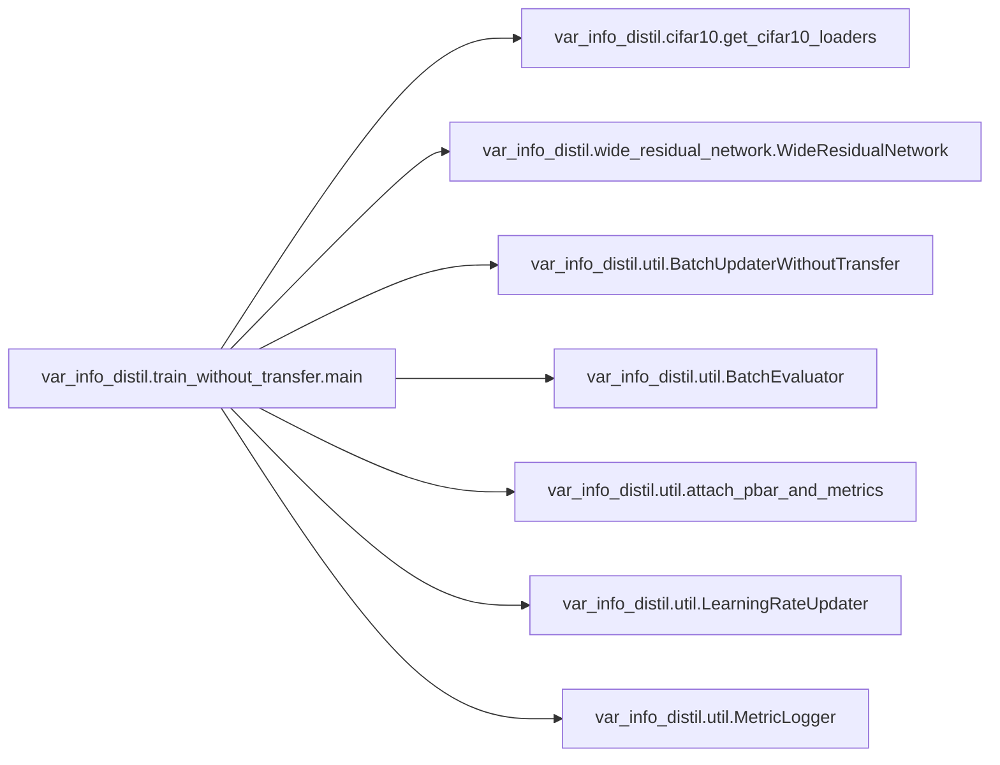
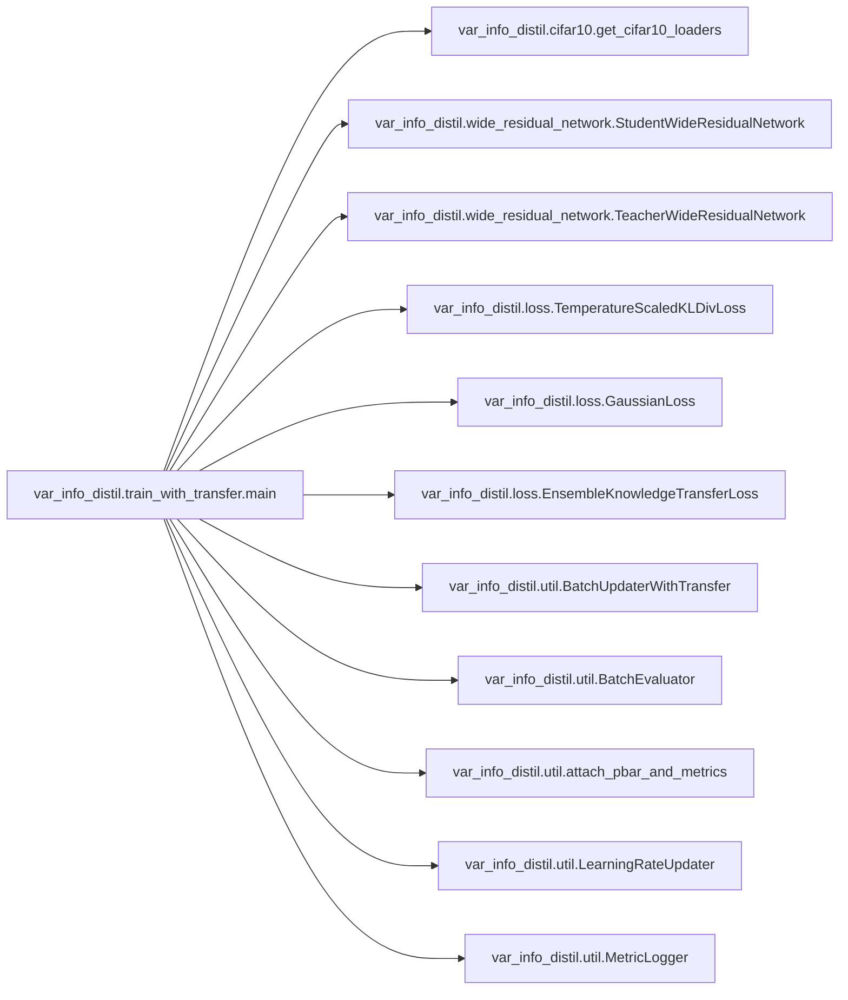

# Key Objects

[_Documentation generated by Documatic_](https://www.documatic.com)

<!---Documatic-section-var_info_distil.cifar10.get_cifar10_loaders-start--->
## var_info_distil.cifar10.get_cifar10_loaders

<!---Documatic-section-get_cifar10_loaders-start--->
<!---Documatic-block-var_info_distil.cifar10.get_cifar10_loaders-start--->
<details>
	<summary><code>var_info_distil.cifar10.get_cifar10_loaders</code> code snippet</summary>

```python
def get_cifar10_loaders(root, batch_size, num_workers):
    eval_transform = T.Compose([T.ToTensor(), T.Normalize(np.array(CIFAR10_MEAN), np.array(CIFAR10_AVERAGE))])
    train_transform = T.Compose([T.Pad(CIFAR10_PAD_SIZE, padding_mode='reflect'), T.RandomHorizontalFlip(), T.RandomCrop(CIFAR10_CROP_SIZE), eval_transform])
    train_and_validation_dataset_with_train_transform = torchvision.datasets.CIFAR10(root=root, train=True, download=True, transform=train_transform)
    train_and_validation_dataset_with_eval_transform = torchvision.datasets.CIFAR10(root=root, train=True, download=False, transform=eval_transform)
    train_and_validation_indices = torch.randperm(len(train_and_validation_dataset_with_train_transform))
    train_indices = train_and_validation_indices[:CIFAR10_TRAIN_SIZE]
    validation_indices = train_and_validation_indices[CIFAR10_TRAIN_SIZE:CIFAR10_TRAIN_SIZE + CIFAR10_VALIDATION_SIZE]
    train_dataset = torch.utils.data.Subset(train_and_validation_dataset_with_train_transform, train_indices)
    validation_dataset = torch.utils.data.Subset(train_and_validation_dataset_with_eval_transform, validation_indices)
    test_dataset = torchvision.datasets.CIFAR10(root=root, train=False, download=False, transform=eval_transform)
    train_loader = torch.utils.data.DataLoader(dataset=train_dataset, batch_size=batch_size, shuffle=True, num_workers=num_workers)
    validation_loader = torch.utils.data.DataLoader(dataset=validation_dataset, batch_size=batch_size, shuffle=False, num_workers=num_workers)
    test_loader = torch.utils.data.DataLoader(dataset=test_dataset, batch_size=batch_size, shuffle=False, num_workers=num_workers)
    return (train_loader, validation_loader, test_loader)
```
</details>
<!---Documatic-block-var_info_distil.cifar10.get_cifar10_loaders-end--->
<!---Documatic-section-get_cifar10_loaders-end--->

# #
<!---Documatic-section-var_info_distil.cifar10.get_cifar10_loaders-end--->

<!---Documatic-section-var_info_distil.train_without_transfer.main-start--->
## var_info_distil.train_without_transfer.main

<!---Documatic-section-main-start--->


### Object Calls

* var_info_distil.cifar10.get_cifar10_loaders
* var_info_distil.wide_residual_network.WideResidualNetwork
* var_info_distil.util.BatchUpdaterWithoutTransfer
* var_info_distil.util.BatchEvaluator
* var_info_distil.util.attach_pbar_and_metrics
* var_info_distil.util.LearningRateUpdater
* var_info_distil.util.MetricLogger

<!---Documatic-block-var_info_distil.train_without_transfer.main-start--->
<details>
	<summary><code>var_info_distil.train_without_transfer.main</code> code snippet</summary>

```python
def main(width, depth, max_epochs, state_dict_path, device, data_dir, num_workers):
    device = torch.device(device)
    (train_loader, validation_loader, test_loader) = get_cifar10_loaders(data_dir, batch_size=BATCH_SIZE, num_workers=num_workers)
    model = WideResidualNetwork(depth=depth, width=width)
    model = model.to(device)
    optimizer = torch.optim.SGD(model.parameters(), lr=LEARNING_RATE, momentum=MOMENTUM, weight_decay=WEIGHT_DECAY)
    lr_scheduler = torch.optim.lr_scheduler.MultiStepLR(optimizer, milestones=LEARNING_RATE_DECAY_MILESTONES, gamma=LEARNING_RATE_DECAY_FACTOR)
    criterion = torch.nn.CrossEntropyLoss()
    batch_updater = BatchUpdaterWithoutTransfer(model=model, optimizer=optimizer, criterion=criterion, device=device)
    batch_evaluator = BatchEvaluator(model=model, device=device)
    trainer = Engine(batch_updater)
    evaluator = Engine(batch_evaluator)
    attach_pbar_and_metrics(trainer, evaluator)
    lr_updater = LearningRateUpdater(lr_scheduler=lr_scheduler)
    trainer.on(Events.EPOCH_COMPLETED(every=1))(lr_updater)
    metric_logger = MetricLogger(evaluator=evaluator, eval_loader=validation_loader)
    trainer.on(Events.EPOCH_COMPLETED(every=1))(metric_logger)
    trainer.run(train_loader, max_epochs=max_epochs)
    model.cpu()
    state_dict_dir = '/'.join(state_dict_path.split('/')[:-1])
    os.makedirs(state_dict_dir, exist_ok=True)
    torch.save(model.state_dict(), state_dict_path)
```
</details>
<!---Documatic-block-var_info_distil.train_without_transfer.main-end--->
<!---Documatic-section-main-end--->

# #
<!---Documatic-section-var_info_distil.train_without_transfer.main-end--->

<!---Documatic-section-var_info_distil.wide_residual_network.conv1x1-start--->
## var_info_distil.wide_residual_network.conv1x1

<!---Documatic-section-conv1x1-start--->
<!---Documatic-block-var_info_distil.wide_residual_network.conv1x1-start--->
<details>
	<summary><code>var_info_distil.wide_residual_network.conv1x1</code> code snippet</summary>

```python
def conv1x1(in_channels, out_channels, stride=1):
    return nn.Conv2d(in_channels, out_channels, kernel_size=1, padding=0, bias=False, stride=stride)
```
</details>
<!---Documatic-block-var_info_distil.wide_residual_network.conv1x1-end--->
<!---Documatic-section-conv1x1-end--->

# #
<!---Documatic-section-var_info_distil.wide_residual_network.conv1x1-end--->

<!---Documatic-section-var_info_distil.train_with_transfer.main-start--->
## var_info_distil.train_with_transfer.main

<!---Documatic-section-main-start--->


### Object Calls

* var_info_distil.cifar10.get_cifar10_loaders
* var_info_distil.wide_residual_network.StudentWideResidualNetwork
* var_info_distil.wide_residual_network.TeacherWideResidualNetwork
* var_info_distil.loss.TemperatureScaledKLDivLoss
* var_info_distil.loss.GaussianLoss
* var_info_distil.loss.EnsembleKnowledgeTransferLoss
* var_info_distil.util.BatchUpdaterWithTransfer
* var_info_distil.util.BatchEvaluator
* var_info_distil.util.attach_pbar_and_metrics
* var_info_distil.util.LearningRateUpdater
* var_info_distil.util.MetricLogger

<!---Documatic-block-var_info_distil.train_with_transfer.main-start--->
<details>
	<summary><code>var_info_distil.train_with_transfer.main</code> code snippet</summary>

```python
def main(student_depth, student_width, teacher_depth, teacher_width, max_epochs, variational_information_distillation_factor, knowledge_distillation_factor, knowledge_distillation_temperature, state_dict_path, teacher_state_dict_path, device, data_dir, num_workers):
    device = torch.device(device)
    (train_loader, validation_loader, test_loader) = get_cifar10_loaders(data_dir, batch_size=BATCH_SIZE, num_workers=num_workers)
    model = StudentWideResidualNetwork(depth=student_depth, width=student_width, teacher_width=teacher_width)
    model = model.to(device)
    teacher_model = TeacherWideResidualNetwork(depth=teacher_depth, width=teacher_width, load_path=teacher_state_dict_path)
    teacher_model = teacher_model.to(device)
    optimizer = torch.optim.SGD(model.parameters(), lr=LEARNING_RATE, momentum=MOMENTUM, weight_decay=WEIGHT_DECAY)
    lr_scheduler = torch.optim.lr_scheduler.MultiStepLR(optimizer, milestones=LEARNING_RATE_DECAY_MILESTONES, gamma=LEARNING_RATE_DECAY_FACTOR)
    label_criterion = torch.nn.CrossEntropyLoss()
    teacher_logit_criterion = TemperatureScaledKLDivLoss(temperature=knowledge_distillation_temperature)
    teacher_feature_criterion = GaussianLoss()
    criterion = EnsembleKnowledgeTransferLoss(label_criterion=label_criterion, teacher_logit_criterion=teacher_logit_criterion, teacher_feature_criterion=teacher_feature_criterion, teacher_logit_factor=knowledge_distillation_factor, teacher_feature_factor=variational_information_distillation_factor)
    batch_updater = BatchUpdaterWithTransfer(model=model, teacher_model=teacher_model, optimizer=optimizer, criterion=criterion, device=device)
    batch_evaluator = BatchEvaluator(model=model, device=device)
    trainer = Engine(batch_updater)
    evaluator = Engine(batch_evaluator)
    attach_pbar_and_metrics(trainer, evaluator)
    lr_updater = LearningRateUpdater(lr_scheduler=lr_scheduler)
    trainer.on(Events.EPOCH_COMPLETED(every=1))(lr_updater)
    metric_logger = MetricLogger(evaluator=evaluator, eval_loader=validation_loader)
    trainer.on(Events.EPOCH_COMPLETED(every=1))(metric_logger)
    trainer.run(train_loader, max_epochs=max_epochs)
    model.cpu()
    state_dict_dir = '/'.join(state_dict_path.split('/')[:-1])
    os.makedirs(state_dict_dir, exist_ok=True)
    torch.save(model.state_dict(), state_dict_path)
```
</details>
<!---Documatic-block-var_info_distil.train_with_transfer.main-end--->
<!---Documatic-section-main-end--->

# #
<!---Documatic-section-var_info_distil.train_with_transfer.main-end--->

<!---Documatic-section-var_info_distil.util.prepare_batch-start--->
## var_info_distil.util.prepare_batch

<!---Documatic-section-prepare_batch-start--->
<!---Documatic-block-var_info_distil.util.prepare_batch-start--->
<details>
	<summary><code>var_info_distil.util.prepare_batch</code> code snippet</summary>

```python
def prepare_batch(batch, device):
    (image, label) = batch
    image = image.to(device)
    label = label.to(device)
    return (image, label)
```
</details>
<!---Documatic-block-var_info_distil.util.prepare_batch-end--->
<!---Documatic-section-prepare_batch-end--->

# #
<!---Documatic-section-var_info_distil.util.prepare_batch-end--->

<!---Documatic-section-var_info_distil.util.attach_pbar_and_metrics-start--->
## var_info_distil.util.attach_pbar_and_metrics

<!---Documatic-section-attach_pbar_and_metrics-start--->
<!---Documatic-block-var_info_distil.util.attach_pbar_and_metrics-start--->
<details>
	<summary><code>var_info_distil.util.attach_pbar_and_metrics</code> code snippet</summary>

```python
def attach_pbar_and_metrics(trainer, evaluator):
    loss_metric = Average(output_transform=lambda output: output['loss'])
    accuracy_metric = Accuracy(output_transform=lambda output: (output['logit'], output['label']))
    pbar = ProgressBar()
    loss_metric.attach(trainer, 'loss')
    accuracy_metric.attach(trainer, 'accuracy')
    accuracy_metric.attach(evaluator, 'accuracy')
    pbar.attach(trainer)
```
</details>
<!---Documatic-block-var_info_distil.util.attach_pbar_and_metrics-end--->
<!---Documatic-section-attach_pbar_and_metrics-end--->

# #
<!---Documatic-section-var_info_distil.util.attach_pbar_and_metrics-end--->

<!---Documatic-section-var_info_distil.wide_residual_network.conv3x3-start--->
## var_info_distil.wide_residual_network.conv3x3

<!---Documatic-section-conv3x3-start--->
<!---Documatic-block-var_info_distil.wide_residual_network.conv3x3-start--->
<details>
	<summary><code>var_info_distil.wide_residual_network.conv3x3</code> code snippet</summary>

```python
def conv3x3(in_channels, out_channels, stride=1):
    return nn.Conv2d(in_channels, out_channels, kernel_size=3, padding=1, bias=False, stride=stride)
```
</details>
<!---Documatic-block-var_info_distil.wide_residual_network.conv3x3-end--->
<!---Documatic-section-conv3x3-end--->

# #
<!---Documatic-section-var_info_distil.wide_residual_network.conv3x3-end--->

[_Documentation generated by Documatic_](https://www.documatic.com)